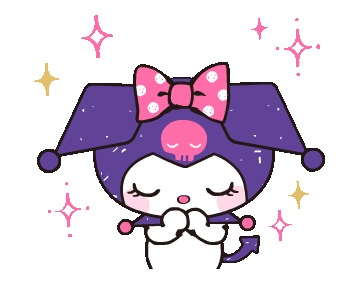
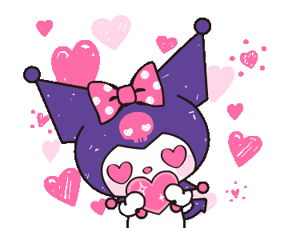
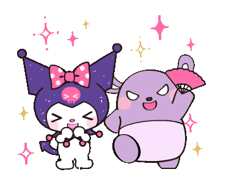
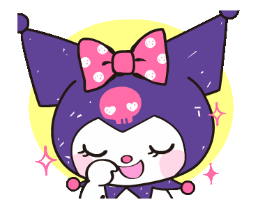
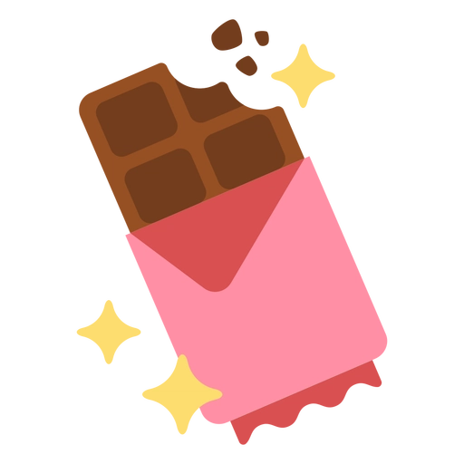
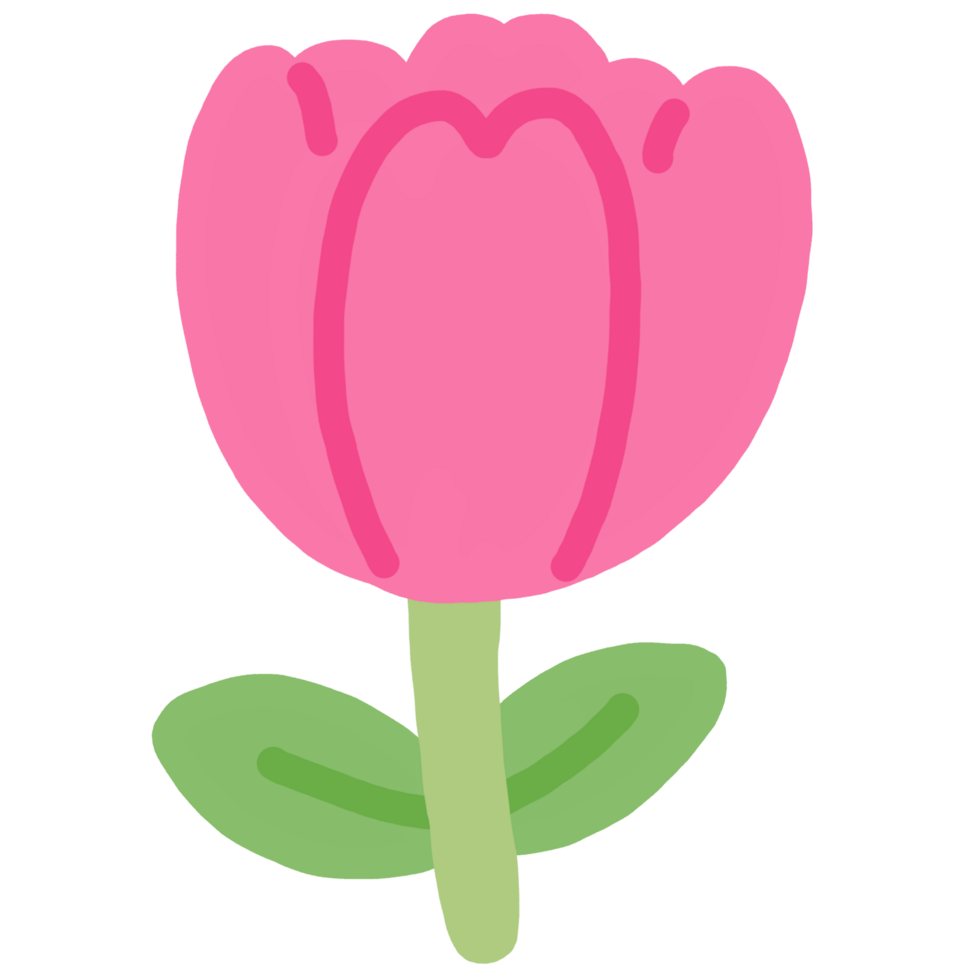
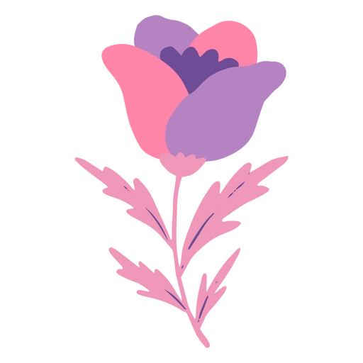

# 🌸 Kumi — Soft, Ambient Valentine Page 🌙✨

A gentle, cozy little one‑page site made for a quiet confession — with falling soft‑toy rain, pastel vibes, and tiny toast moments. 💌🧸🍃

## ✨ What It Is
- A single‑page “valentine week” message flow with smooth transitions.
- Ambient falling GIFs and subtle color shifts for a dreamy mood.
- A tiny “munch credit” counter that shows cute toasts.
- Optional email notification when someone chooses a response.

## 🌈 Features
- Pastel palette + soft typography.
- Animated falling images (ambient rain effect).
- Section‑based flow: `home → message → question → yes/later`.
- Toast notifications for “munch credits.”
- Optional serverless email (Resend) integration.

## 🖼️ Sticker Vibes From `images/`

### Sticker Strip

### Sticker Clusters

## 🗂️ Project Structure
- `index.html`
- `css/style.css`
- `js/script.js`
- `images/`
- `api/send-email.js`

## 🚀 Run Locally
- Open `index.html` directly in a browser.
- Or serve the folder with any static server (optional).

## ☁️ Deploy Notes
- This works as a static site.
- If you want the email notification to work, deploy on a platform that supports serverless functions (e.g., Vercel).

## 🔑 Environment Variables (for email)
- `RESEND_API_KEY`
- `EMAIL_TO`

## 🔍 Privacy / Tracking Note
- When a user clicks `Yes` or `Later`, the site collects:
- IP address (via `https://api.ipify.org`)
- Device info (browser user agent)
- This is sent to `/api/send-email` for notification.
- Remove that logic in `js/script.js` if you don’t want tracking.

## 🎨 Customize The Vibe
- Text: `index.html`
- Colors: `css/style.css`
- Behavior: `js/script.js`
- Assets: `images/`

## 💖 Credits
- Made with quiet intent, soft colors, and a lot of care. 🌷✨
- Image credits belong to their respective owners, shared here with appreciation. 🖼️🙏
- Thanks to Vercel for free deployment. ☁️💙
---
